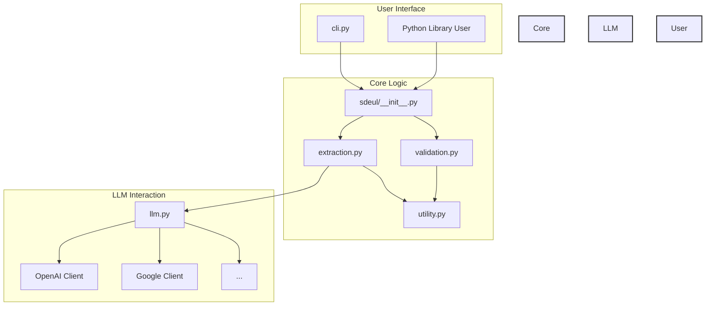

# System Patterns

## Architecture Overview

`sdeul` appears to follow a modular design, separating concerns into distinct Python modules:

*   **`cli.py`:** Handles command-line argument parsing and orchestrates the workflow for CLI usage. Likely uses a library like `argparse` or `click`.
*   **`llm.py`:** Encapsulates interactions with various LLM providers. Likely contains abstractions or specific client implementations for each supported LLM (OpenAI, Google, etc.). This promotes modularity for adding new providers.
*   **`extraction.py`:** Contains the core logic for prompting the LLM to perform the data extraction task.
*   **`validation.py`:** Implements the JSON schema validation logic, likely using a library like `jsonschema`.
*   **`utility.py`:** Holds helper functions or common utilities used across different modules.
*   **`__init__.py`:** Defines the public interface of the `sdeul` library, making functions/classes accessible for import.

## Key Technical Decisions (Inferred)

*   **Provider Abstraction:** Using a dedicated module (`llm.py`) suggests an abstraction layer to handle different LLM APIs uniformly, simplifying the core extraction logic.
*   **Schema-Driven Extraction:** The core functionality relies on a user-provided JSON schema to guide the LLM and validate the output.
*   **CLI & Library:** The project serves dual purposes: a standalone tool (`cli.py`) and an importable library (`__init__.py`).

## Design Patterns (Potential)

*   **Strategy Pattern:** The `llm.py` module might use the Strategy pattern to switch between different LLM provider implementations based on configuration.
*   **Facade Pattern:** The `__init__.py` or specific functions within it might act as a Facade, providing a simplified interface to the library's capabilities.

## Component Relationships

*(Note: This initial assessment is based on file names and project goals. It requires validation by examining the actual code.)*
